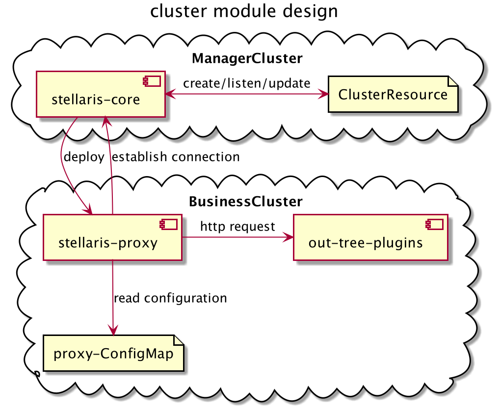
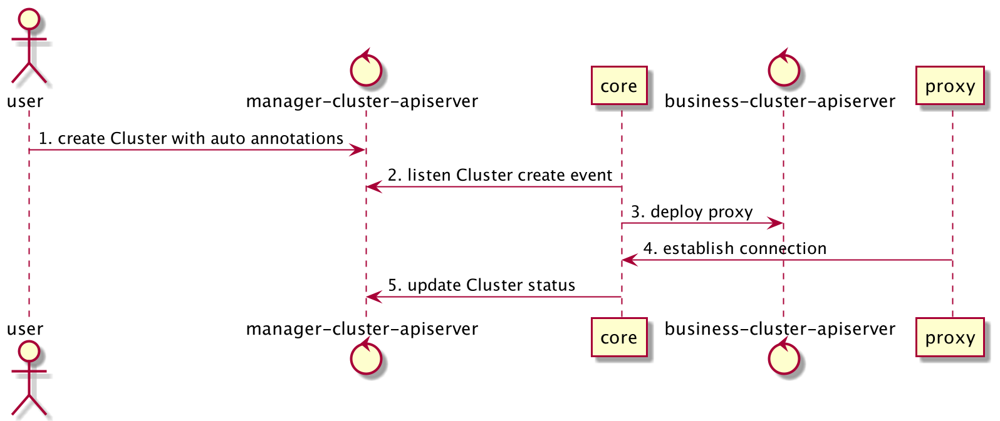
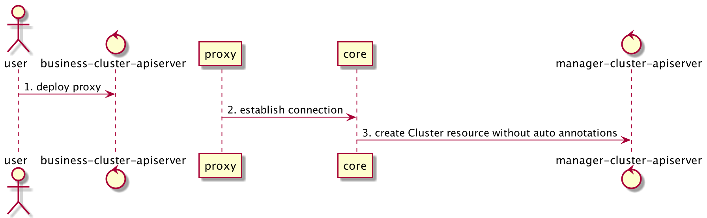

# 多集群管理模块设计

最后修改时间：2021/2/21

## 整体设计



多集群管理模块将在管理集群中创建对应业务集群的 Cluster 资源映射，该资源包含业务集群名称、状态。

多集群管理模块允许用户在 proxy 中开启自定义插件返回自定义信息，例如监控业务集群的资源使用情况、组件健康状态等信息。

## 设计详情

### Cluster CRD Example

```yaml
apiVersion: stellaris.harmonycloud.cn/v1alpha1
kind: Cluster
metadata:
  name: <cluster name>
spec:
  apiserver: <apiserver addr>
  secretRef:
    type: kubeconfig # or use token
    name: cluster-238-secret
    namespace: stellaris-system
    field: admin.conf
  addons:
  - type: in-tree
    name: <in-tree plugin name>
    configuration: <configuration object>
  - type: out-tree
    name: <out-tree plugin name>
    url: <out tree plugin url>
...
status:
  addons:
  - name: cluster.skyview.harmonycloud
    info: <info object>
  conditions:
  - timestamp: "2021-11-02T08:51:39Z"
    message: Apiserver cannot provider service in this cluster
    reason: ApiserverIsDown
    type: KubernetesUnavailable
  lastReceiveHeartBeatTimestamp: <timestamp>
  lastUpdateTimestamp: <timestamp>
  healthy: true/false
  status: online/offline/initializing
```

### 集群纳管

纳管集群共分为两种模式：
* 通过在管理集群中创建 Cluster 对象，由 core 向目标集群中部署 proxy 完成纳管；

* 手动再目标集群中部署proxy，并填写管理集群 core 组件地址作为 proxy 启动参数，proxy 与 core 建立连接后，由 core 在管理集群创建 Cluster 对象完成纳管；


#### 自动部署 Proxy

自动部署时，用户在管理集群创建 Cluster 对象，必须填入以下参数：

| 字段                     | 释义                                                       | 示例                 |
| ------------------------ | ---------------------------------------------------------- | -------------------- |
| spec.apiserver           | 管理集群至业务集群 apiserver 可达地址                      | https://1.2.3.4:8443 |
| spec.secretRef.type      | 管理集群中至业务集群访问秘钥类型，可选 token 或 kubeconfig | token                |
| spec.secretRef.name      | 管理集群中对应业务集群的秘钥名称                           | cluster-x-secret     |
| spec.secretRef.namespace | 管理集群中对应业务集群的秘钥所在命名空间                   | stellaris-system     |
| spec.secretRef.field     | 管理集群中对应业务集群的秘钥在 Secret 中对应字段           | admin.conf           |

通过设置 core 启动参数 `--cue-template-config-map` 指定读取的 ConfigMap，core 将读取该 ConfigMap 中 `deploy-proxy.cue` 字段。

其中 CUE 模板如下：
```cuelang
// 上下文对象目前仅包含 context.name (集群名称)
context: {}

// 通过 cluster.spec.configuration 作为入参
parameters: {}

// XX 为不重复的 key 值，value 作为部署到业务集群的资源
outputs.XX: {}
```

默认预置的 template 包含以下参数：

```cuelang
parameters: {
    // 资源名称
    name: *"stellaris-proxy" | string
    // 资源命名空间
    namespace: *"stellaris-system" | string
    // proxy 运行副本数
    replicas: *1 | int
    // proxy 镜像
    image: string
    // proxy 连接 core 使用的地址
    coreAddr: string
    // proxy 在业务集群中使用的 ClusterRole
    clusterRole: string
}
```

自动部署时，用户在管理集群创建 Cluster 对象，可以通过配置 `spec.addons` 决定自动部署的 proxy 需要开启哪些插件。

### 插件设计

proxy 通过配置开启插件，每一个心跳周期内，proxy 将检查插件返回的数据并增量进行更新。

插件配置设计如下：

```yaml
plugins:
  inTree:
  - name: etcd
    configuration:
      <plugin configuration object>
  - name: apiserver
    configuration:
      <plugin configuration object>
  outTree:
  - name: external-plugin
    http:
      url: <http url>
```